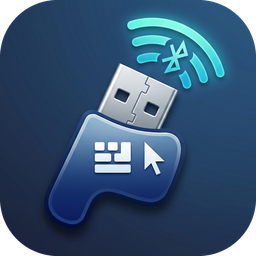
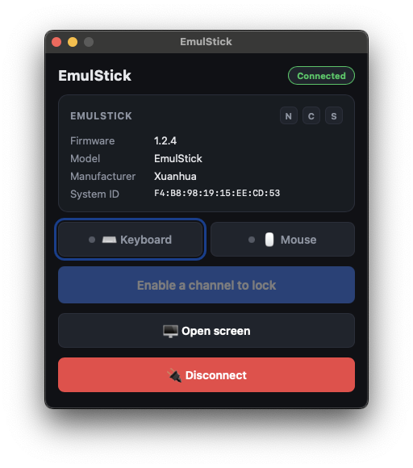
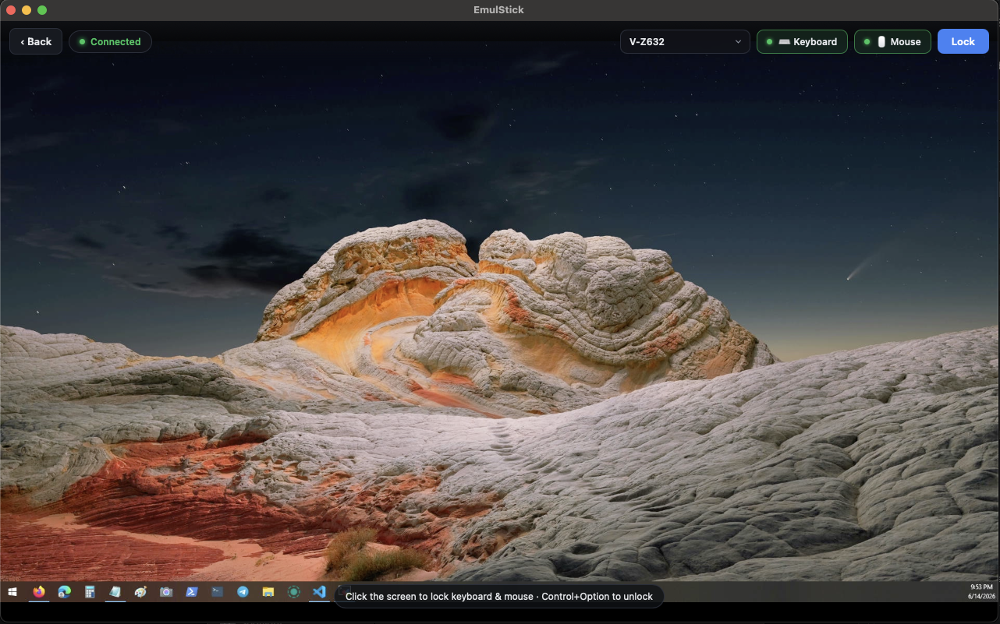

<div align="center">



# EmulStick Desktop

**Wirelessly drive another machine's keyboard &amp; mouse — a Bluetooth-LE HID KVM, right on your desktop.**

[](#prerequisites)
[](https://tauri.app)
[](https://svelte.dev)
[](https://rustup.rs)
[](docs/ble-protocol.md)
[](https://github.com/Crazycurly/EmulStick-GUI/releases/latest)

</div>

Operator-side console for the **[EmulStick](https://emulstick.com)** BLE HID emulator — a plug-and-play USB 2.0 dongle that the target sees as a standard USB keyboard/mouse/gamepad while receiving input over Bluetooth LE (no drivers, no pairing). This is a native desktop app (Tauri 2 + Svelte + Rust) that pairs with the dongle and forwards your real keyboard and mouse to a target computer — **including the reserved shortcuts** (`⌘Tab`, `Win`, `Ctrl`+`Alt`+`Del`, `⌘`+`Space`…) that a browser-based tool can never intercept. Pipe the target's HDMI through a USB capture card and you get a full PiKVM-style remote console — no agent installed on the target, which sees only a plain USB keyboard/mouse.

> The EmulStick dongle is a commercial product — see **[emulstick.com](https://emulstick.com)** for the hardware and where to buy. This repository is the desktop operator client for it.

<div align="center">

| Compact console | KVM / video mode |
| :-: | :-: |
|  |  |

</div>

## Download

**[⬇ Download the latest release](https://github.com/Crazycurly/EmulStick-GUI/releases/latest)** — macOS (Apple Silicon).

Open the `.dmg` and drag **EmulStick** to your Applications folder.

> [!NOTE]
> The build is code-signed for development but **not notarized**, so macOS Gatekeeper will flag it on first launch. Either right-click the app → **Open** once, or clear the quarantine flag:
> ```bash
> xattr -dr com.apple.quarantine /Applications/EmulStick.app
> ```
> Then grant **Accessibility** (see [macOS permissions](#macos-permissions)) so input forwarding can work. Prefer to build it yourself? See [Development](#development).

## Features

- 🔗 **BLE bring-up** — scan, connect, read the Device Information Service, write to the F801/F803 HID characteristics, subscribe to keyboard-LED notifications.
- ⌨️🖱️ **Global input capture** — an `rdev::grab` hook consumes events at the OS level, so reserved system shortcuts go to the *target*, not your machine. Mouse uses relative HID deltas with the local cursor frozen.
- 🎛️ **Per-channel passthrough** — independently forward keyboard, mouse, and video; each choice is persisted across launches.
- 🖥️ **HDMI video / KVM mode** — a PiKVM-style full-window feed via any UVC capture card, with live source switching and hot-plug recovery.
- 🔒 **Lock mode** — engage to forward everything; **`Ctrl`+`Alt`/`⌥`** is the always-on emergency unlock. Disconnects, write failures, and channel changes all drop to a safe all-keys-up state so nothing sticks down on the target.
- ♻️ **Persisted device + auto-reconnect** — remembers the last dongle and reconnects with backoff after a drop.
- ⚡ **Tuned for feel** — ~1 kHz input is coalesced and flushed near the BLE connection interval so fast motion never overruns the link (see [`docs/plan.md`](docs/plan.md) §6.3).

## How it works

A **control plane** (Svelte frontend) is split from a **data plane** (Rust backend) so high-frequency input never crosses the JSON IPC bridge.

```
 your keyboard/mouse ─▶ rdev::grab (consume) ─▶ HID encode ─▶ coalesce/flush ─▶ BLE GATT write ─▶ EmulStick dongle ─▶ USB ─▶ target
                                                                                                         target HDMI ─▶ capture card ─▶ getUserMedia ─▶ KVM view
```

- **Frontend** (`src/`) — scan/connect/status UI, passthrough toggles, KVM video, error surfaces. Low-frequency commands/events only.
- **Backend** (`src-tauri/src/`):
  - `protocol/` — HID report encoders (keyboard 8 B / mouse 6 B), the `rdev::Key → HID usage` keymap, and the normative BLE UUIDs. Hardware-independent and unit-tested byte-for-byte against the worked examples in [`docs/protocol.md`](docs/protocol.md).
  - `ble/` — `btleplug` scan/connect with connect timeouts, Device Info readout, write-without-response to F801/F803, LED notifications.
  - `input/` — the `rdev::grab` thread, lock-mode state machine, relative-cursor capture, and §6.3 mouse coalescing.
  - `ipc/` — Tauri commands + events.
  - `state.rs` — passthrough flags and lock state.

See [`docs/plan.md`](docs/plan.md) for the full engineering design, and [`docs/protocol.md`](docs/protocol.md) / [`docs/ble-protocol.md`](docs/ble-protocol.md) for the wire format.

## Status

Milestones **M1–M5 are implemented** (BLE bring-up → input pipeline → passthrough &amp; UI → video → hardening), plus a post-review hardening pass. The app connects to real hardware, captures and forwards keyboard/mouse, persists and auto-reconnects to the last device, and renders a live HDMI KVM feed. See the milestone list in [`docs/plan.md`](docs/plan.md) §12.

## Prerequisites

- [Rust](https://rustup.rs) (stable) and the platform [Tauri prerequisites](https://tauri.app/start/prerequisites/).
- Node.js 18+ and npm.
- An [EmulStick](https://emulstick.com) BLE HID dongle (plugged into the **target**) — available from the official store linked there — and, for video, a UVC HDMI capture card.

## Development

```bash
npm install            # frontend deps + Tauri CLI
npm run tauri dev      # run the app (spawns Vite + the Rust backend)
```

### Useful commands

```bash
npm run build                                     # build the Svelte frontend
npm run check                                     # svelte-check (type-check)
cargo test --manifest-path src-tauri/Cargo.toml   # protocol byte-exact tests
npx tauri icon app-icon.png                       # regenerate icons from the source image
```

## macOS permissions

Global input interception needs **System Settings → Privacy &amp; Security → Accessibility** (and possibly **Input Monitoring**) granted to the app. When lock mode is requested without the grant, the app pops macOS's dialog and shows an in-app onboarding card with an **Open Settings** shortcut; it re-checks automatically when you return to the window. BLE prompts on first use via `NSBluetoothAlwaysUsageDescription`.

Unsigned builds lose the Accessibility grant on every update. For dev iteration the `cargo run` runner re-signs with a stable identity (see [`scripts/sign-and-run.sh`](scripts/sign-and-run.sh)); for distributable, notarized release builds see [`docs/release.md`](docs/release.md).
